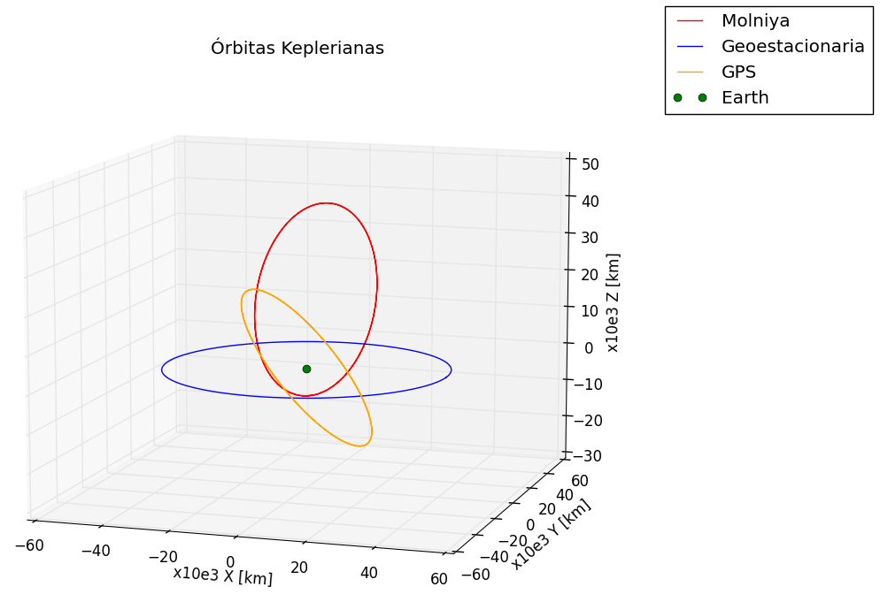
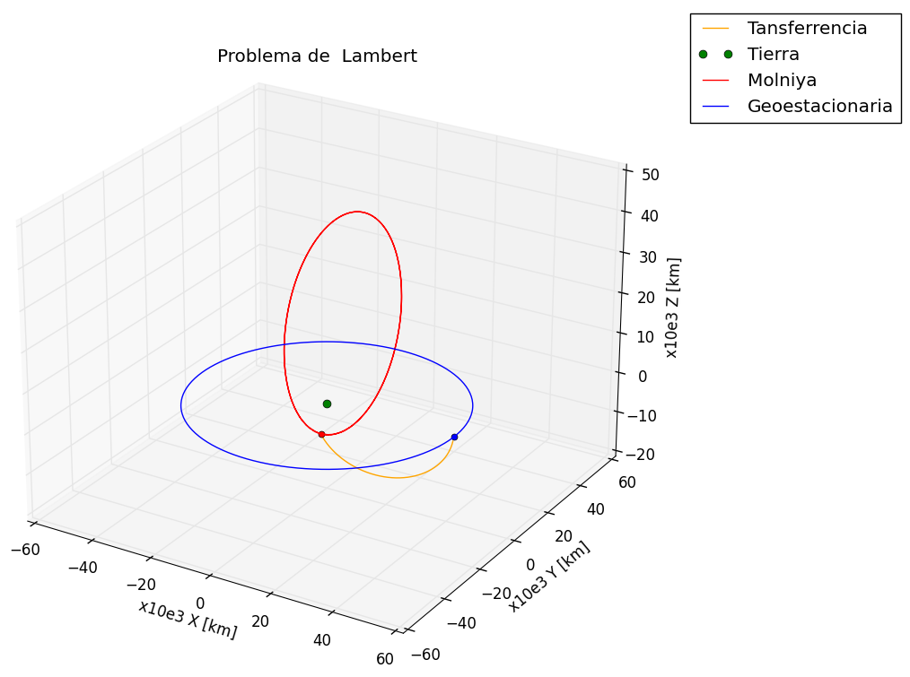
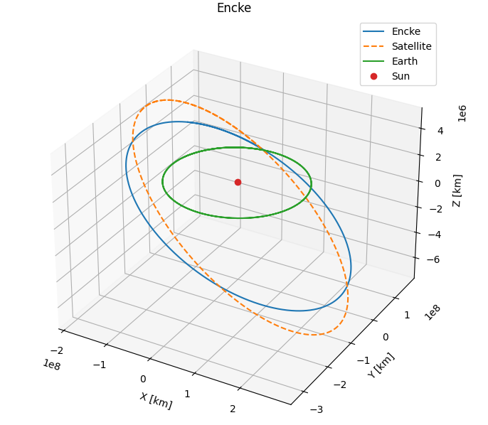
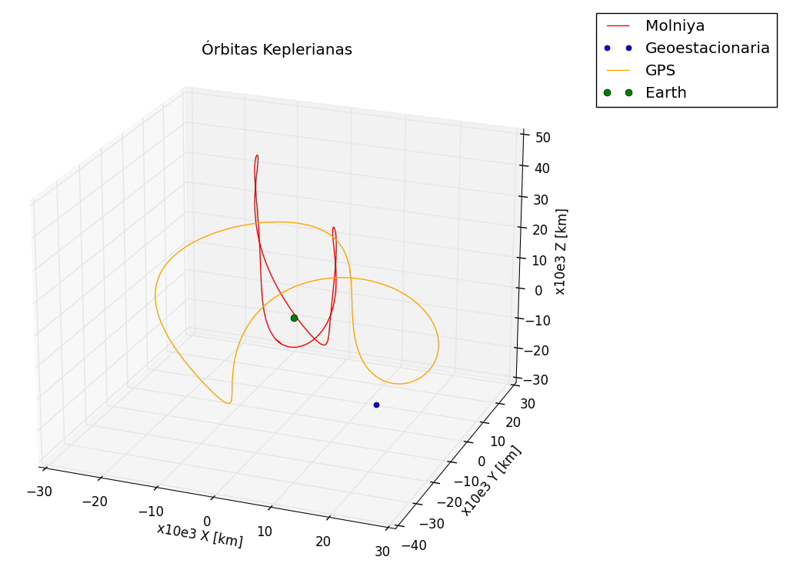
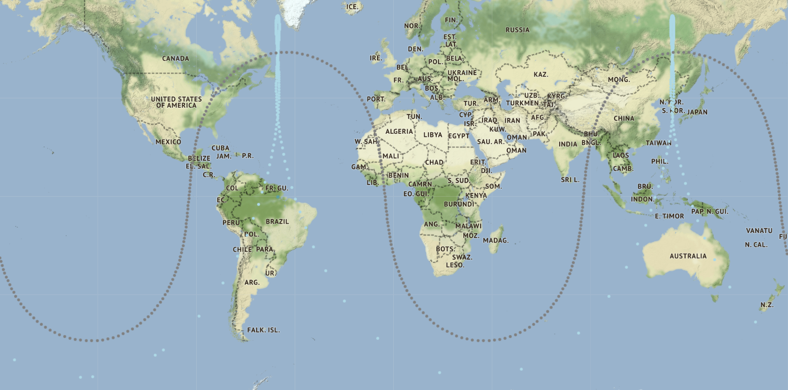

# Simulador para análisis y estudio de misiones espaciales
Proyecto TFG 

### Convocatoria 
Julio 2023

## Introducción
El trabajo tiene por objetivo el desarrollo de un software que sea capaz de
resolver entre otras cosas, los principales parámetros orbitales, valores del campo
magnético, estrellas visibles, ventanas de tiempo, etc. para su aplicación a una determinada
misión espacial, así como la reproducción de las condiciones del entorno espacial en la
Tierra. Para su elaboración se utilizará Python y/o Matlab.

## Funcionalidades

